# Sip of Sarsaparilla

Howdy! You look parched, I bet you could use a Sip of Sarsaparilla!

Sip of Sarsaparilla is a mod that adds western-themed blocks and gear, 
adds some new buildings to villages, and aims to add fun events and such
to spice up your Minecraft journey.

Sip of Sarsaparilla is an update and expansion of Minecraft: Yellow 
focused more on decoration and world generation.
Originally a collection of western-themed ideas, Sip of Sarsaparilla
has become its own thing, just a cute little western-themed mod containing
bits and bobs I wanted to add.

## A Sip of Sarsaparilla

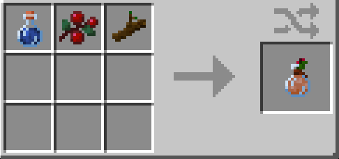

*"Ya feel lucky punk?"*

If you want to feel lucky yourself, craft up a bottle of sarsaparilla!
All it takes is a twig of sassafras, a bottle of water, and a couple
of berries as a finishing touch!

## Gear

Sip of Sarsaparilla adds a few bits of gear you might like!

### Cowboy Hat

You won't find a single self-respecting cowboy without a good hat!
They're the best way to show the world you mean business!

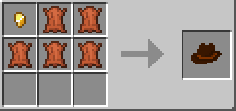
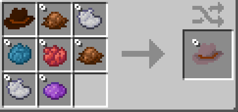

Crafted out of leather and a bit of gold, these bad boys can be 
dyed to fit the rest of your aesthetic.

### Bandanna

You need to cover up? Craft a bandanna!

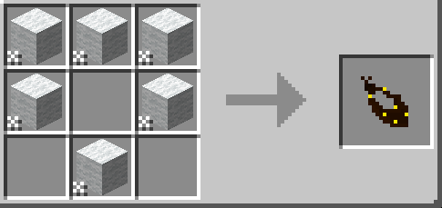
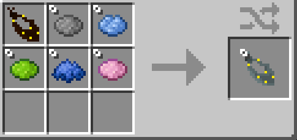

Available in a wide variety of colors, these bad boys are the
*second* best way to show the world you mean business!

### ...and more?

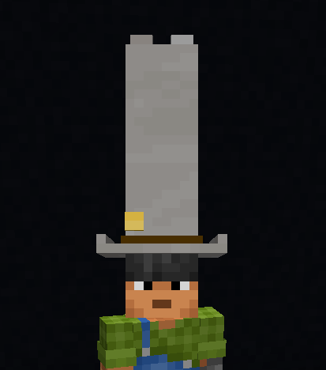

*"Not right!"*

## Weapons

Sip of Sarsaparilla adds a few weapons.

Well, it adds a few guns.

### Popgun

The Popgun is a toy. 
It technically does damage, but, like.
It's a toy.

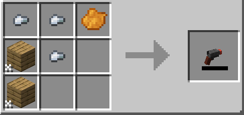

***friend inside me***

### Wild Revolver

The Wild Revolver, named after a weapon from Undertale: Yellow, is your
garden-variety, bog-standard, rootin'-and-or-tootin' gun. 
Stuff it full of Revolver Rounds and fire away!

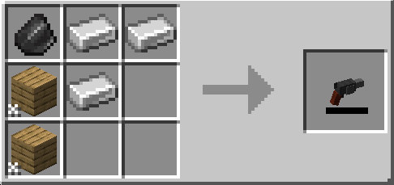

*"What are you gonna do, shoot me?"*

### Golden Gun

The Golden Gun is a wickedly powerful revolver you can make out of the 
Wild Revolver and some, well, gold.

This gun only holds one round at a time, though, so you better make
it count!

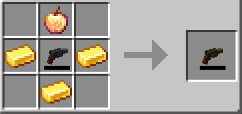

*A gun made out of gold seems impractical at best...*

### Revolver Rounds

You can make revolver rounds pretty simply out of iron and gold nuggets.

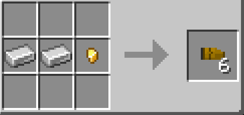

*Let me know when they add revolver squares...*

## Worldgen

Sip of Sarsaparilla adds a few touches to the world:

### Sassafras Trees

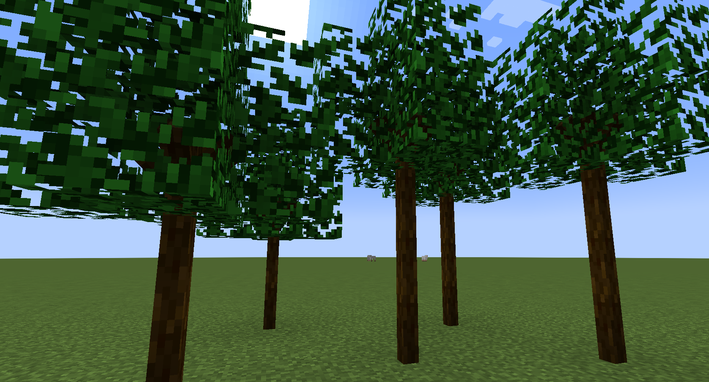

Small trees, great for decoration, and tasty to boot!

Sassafras trees aren't anything special, but they can be used for most
thing you'd use logs for, and crafted into a refreshing drink.
Tasty!

You can find them growing in forests.

### Saloons

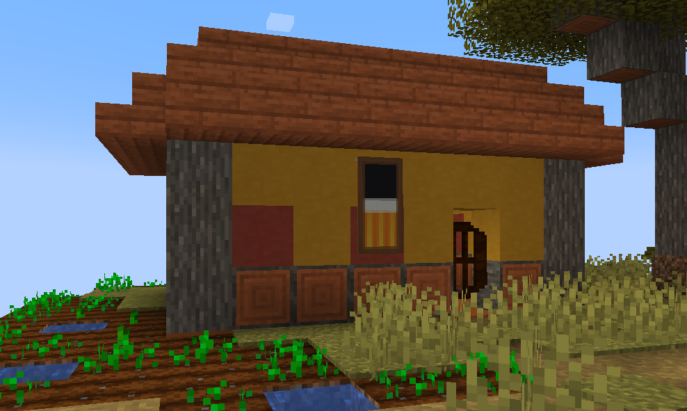
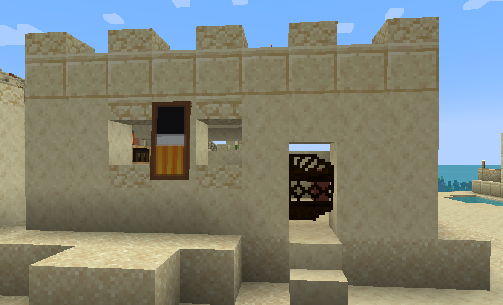

*"You will never find a more wretched hive of scum and villainy."*

Saloons are new buildings you might find in villages. 
Currently, they're just another building, but if you have Wild Wasteland
enabled, you might run into some interesting characters here...

## And More!

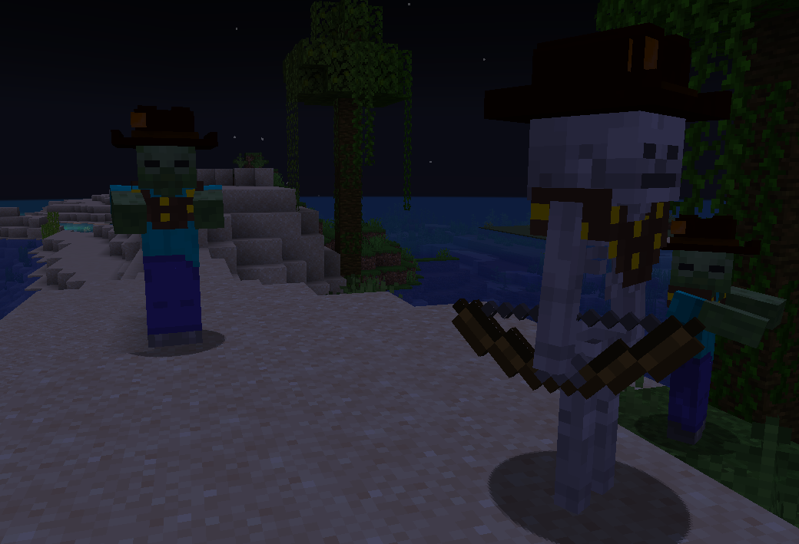

Sip of Sarsaparilla also adds new gear to mobs, Saloon Doors for 
every wood type, and will continue to receive new bits and pieces 
as time goes on.

## Wild Wasteland

Wild Wasteland is currently planned as an expansion to Sip of Sarsaparilla,
rather than a gamerule as previously implemented.
Stay tuned!